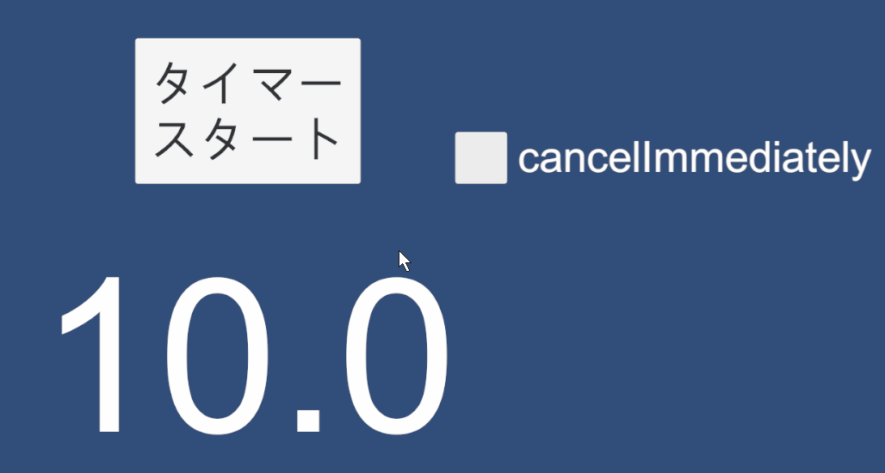

# UniTaskCancelImmediately

[Unity Advent Calendar 2023](https://qiita.com/advent-calendar/2023/unity) 14日目に投降した 「[UniTaskの cancelImmediately フラグについて](https://qiita.com/Euglenach/private/6623d96d5b93ff52e816)」という記事のサンプルです


UniTask のファクトリメソッドに渡せる `cancelImmediately` によって挙動が変わることが見れます。詳しくは記事で。



```csharp
using System.Threading;
using Cysharp.Threading.Tasks;
using UnityEngine;
using UnityEngine.UI;

public class Timer : MonoBehaviour
{
    [SerializeField] private Text timeText;
    [SerializeField] private Button button;
    [SerializeField] private Toggle cancelImmediatelyToggle;
    
    private CancellationTokenSource timerCancellation;
    
    async UniTask CountdownAsync(float seconds, CancellationToken cancellationToken)
    {
        // カウントダウンの開始時に文字を赤くする
        timeText.color = Color.red;

        try
        {
            while(!cancellationToken.IsCancellationRequested)
            {
                // 時間を更新
                timeText.text = seconds.ToString("N1");
                seconds = Mathf.Max(0, seconds - Time.deltaTime);
                if(seconds <= 0) break;
                
                // cancelImmediately falseで待つ
                await UniTask.NextFrame(cancellationToken, cancelImmediately: cancelImmediatelyToggle.isOn);
            }
        } finally
        {
            // カウントダウンが終わったら文字を白くする
            if(timeText) timeText.color = Color.white;
        }
    }
    
    private void Start()
    {
        button.onClick.AddListener(() =>
        {
            timerCancellation?.Cancel();
            timerCancellation = new();
            CountdownAsync(10, timerCancellation.Token).Forget();
        });
    }
}
```